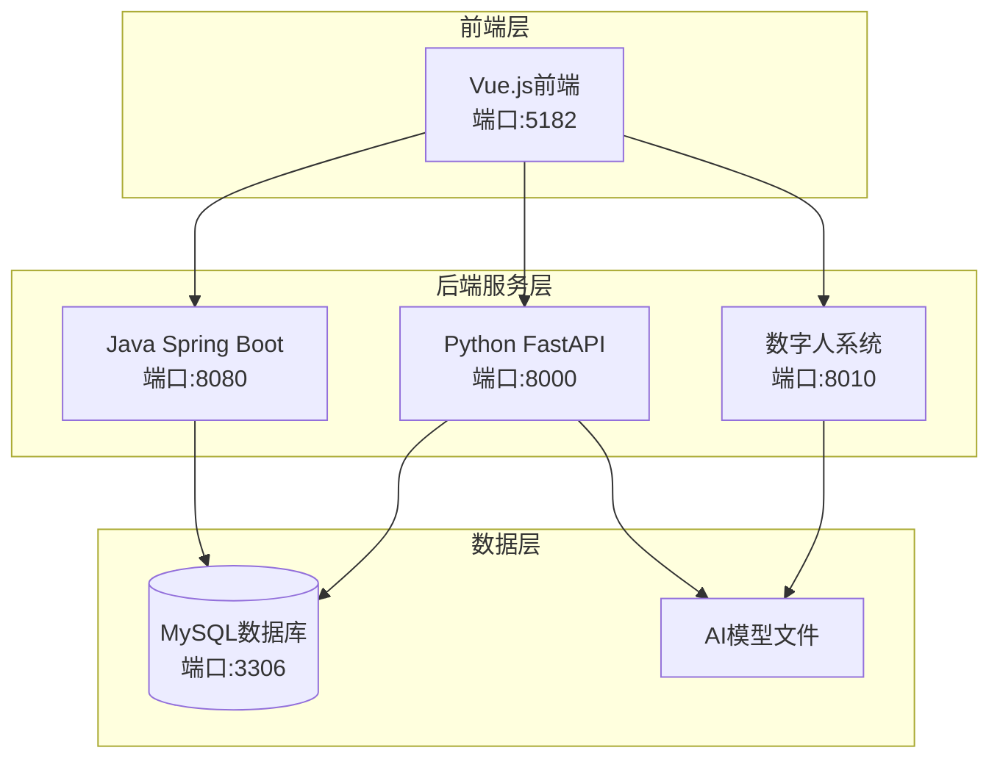

# 教育平台开发环境配置指南

## 项目概述
本项目是一个智能教育平台，包含以下四个主要组件：

1. **Java Spring Boot 后端** (`Edu_platform/`) - RESTful API服务
2. **Python FastAPI AI 服务** (`Edu_py/`) - AI智能服务（知识图谱、题目生成等）
3. **Vue.js 前端** (`EduGenius/`) - 用户界面
4. **数字人系统** (`avatar_py/`) - 虚拟教师和语音交互

## 系统架构图



## 环境准备

### 1. 系统要求
- **操作系统**: Windows 10/11, macOS, Linux
- **内存**: 建议16GB以上（数字人系统需要GPU）
- **磁盘空间**: 至少20GB（用于AI模型文件）

### 2. 软件依赖
| 软件 | 版本要求 | 说明 |
|------|----------|------|
| Java JDK | 17+ | Spring Boot 3.x要求 |
| Python | 3.9+ | AI服务依赖 |
| Node.js | 18+ | 前端开发 |
| MySQL | 5.7+ | 数据库 |
| Maven | 3.6+ | Java项目构建 |
| Git | 最新版 | 代码管理 |

### 3. 安装验证
```bash
# 检查Java
java -version

# 检查Python
python --version

# 检查Node.js
node --version

# 检查MySQL
mysql --version
```

## 数据库配置

### 1. 创建数据库
```sql
-- 创建数据库
CREATE DATABASE mydb CHARACTER SET utf8mb4 COLLATE utf8mb4_unicode_ci;

-- 导入数据库结构（使用项目中的SQL文件）
-- mysql -u root -p mydb < 01014097源码/mydb.sql
```

### 2. 数据库连接配置
**Java后端配置** (`Edu_platform/src/main/resources/application.properties`):
```properties
spring.datasource.url=jdbc:mysql://localhost:3306/mydb?useSSL=false&serverTimezone=Asia/Shanghai&characterEncoding=utf8
spring.datasource.username=root
spring.datasource.password=123456
spring.jpa.hibernate.ddl-auto=update
```

**Python后端配置** (通过环境变量):
```bash
# 设置环境变量
export DB_HOST=localhost
export DB_USER=root
export DB_PASSWORD=123456
export DB_NAME=mydb
```

## Java后端配置

### 1. 项目结构
```
Edu_platform/
├── src/main/java/org/example/     # Java源代码
├── src/main/resources/            # 配置文件
├── pom.xml                        # Maven依赖
└── storage/files/                 # 文件存储目录
```

### 2. 依赖安装
```bash
cd 01014097源码/Edu_platform
mvn clean install
```

### 3. 配置修改
- **CORS配置**: 检查 [`CorsConfig.java`](01014097源码/Edu_platform/src/main/java/org/example/config/CorsConfig.java:17) 中的前端地址
- **文件存储路径**: 检查 [`FileStorageConfig.java`](01014097源码/Edu_platform/src/main/java/org/example/config/FileStorageConfig.java:1) 
- **端口配置**: 默认为8080，可在 `application.properties` 修改

### 4. 启动服务
```bash
cd 01014097源码/Edu_platform
mvn spring-boot:run
# 或运行 Main.java
```

## Python后端配置

### 1. 虚拟环境创建
```bash
cd 01014097源码/Edu_py
python -m venv venv

# Windows
venv\Scripts\activate
# Linux/Mac
source venv/bin/activate
```

### 2. 依赖安装
```bash
pip install -r requirements.txt
```

### 3. API密钥配置
**重要**: 以下API密钥需要替换为有效的密钥：

1. **DashScope API密钥** ([`knowledge_graph_core.py:23`](01014097源码/Edu_py/knowledge_graph_core.py:23)):
```python
# 需要替换为有效的API密钥
client = OpenAI(
    api_key="sk-02fde0221f2648e58e32a9bcb9153452",  # 替换为你的API密钥
    base_url="https://dashscope.aliyuncs.com/compatible-mode/v1",
)
```

2. **其他AI服务密钥** ([`main.py:73-74`](01014097源码/Edu_py/main.py:73-74)):
```python
api_key = "sk-10eea048e8244237b67db0e87a590cd3"  # 替换
app_id = "afd46bbff4ce490388661f3f02fd283f"      # 替换
```

**推荐使用环境变量**:
```bash
# 创建 .env 文件
echo "DASH_SCOPE_API_KEY=your_actual_key" > .env
echo "OTHER_API_KEY=your_other_key" >> .env
```

### 4. 启动Python服务
```bash
cd 01014097源码/Edu_py
python main.py
# 服务将在 http://localhost:8000 启动
```

## 前端配置

### 1. 项目结构
```
EduGenius/
├── src/                    # Vue源代码
├── public/                # 静态资源
├── package.json           # 依赖配置
└── vite.config.mjs       # 构建配置
```

### 2. 依赖安装
```bash
cd 01014097源码/EduGenius
npm install
```

### 3. 配置修改
**API代理配置** (如需修改):
- 检查前端代码中的API地址 (通常为 `http://localhost:8080` 和 `http://localhost:8000`)
- 检查CORS设置

### 4. 启动前端
```bash
cd 01014097源码/EduGenius
npm run dev
# 前端将在 http://localhost:5182 启动
```

## 数字人系统配置

### 1. 项目结构
```
avatar_py/
├── app.py                 # 主应用
├── requirements.txt      # Python依赖
├── models/              # AI模型目录（需要下载）
└── Dockerfile           # 容器化配置
```

### 2. 依赖安装
```bash
cd 01014097源码/avatar_py
pip install -r requirements.txt
```

**重要依赖**:
- PyTorch (需要GPU版本以获得最佳性能)
- OpenCV
- Transformers
- 音频处理库

### 3. 模型文件准备
数字人系统需要以下预训练模型（需手动下载或使用脚本下载）:

1. **Wav2Lip模型** (`models/wav2lip.pth`)
2. **MuseTalk模型** (`models/musetalkV15/`)
3. **Face detection模型** (`models/dwpose/`)

### 4. 启动数字人系统
```bash
cd 01014097源码/avatar_py
python app.py
# 服务将在 http://localhost:8010 启动
```

## 服务启动顺序

为确保系统正常运行，请按以下顺序启动服务：

### 第1步：启动数据库
```bash
# 确保MySQL服务正在运行
sudo systemctl start mysql  # Linux
# 或通过服务管理器启动MySQL
```

### 第2步：启动Java后端
```bash
cd 01014097源码/Edu_platform
mvn spring-boot:run
# 验证: http://localhost:8080
```

### 第3步：启动Python AI服务
```bash
cd 01014097源码/Edu_py
python main.py
# 验证: http://localhost:8000/docs
```

### 第4步：启动数字人系统（可选）
```bash
cd 01014097源码/avatar_py
python app.py
# 验证: http://localhost:8010
```

### 第5步：启动前端
```bash
cd 01014097源码/EduGenius
npm run dev
# 验证: http://localhost:5182
```

## 验证测试

### 1. 数据库连接测试
```bash
mysql -u root -p -e "USE mydb; SELECT COUNT(*) FROM users;"
```

### 2. Java后端测试
```bash
curl http://localhost:8080/api/health
# 或访问 http://localhost:8080
```

### 3. Python服务测试
```bash
curl http://localhost:8000/knowledge-graph
# 或访问 http://localhost:8000/docs
```

### 4. 前端测试
- 访问 http://localhost:5182
- 测试登录功能（使用测试账号）
  - 学生: `student1` / `123456`
  - 教师: `teacher1` / `123456`
  - 管理员: `admin1` / `123456`

### 5. 数字人系统测试
```bash
curl http://localhost:8010/health
```

## 故障排除

### 常见问题1：数据库连接失败
**症状**: Java或Python服务无法连接到数据库
**解决**:
1. 检查MySQL服务是否运行
2. 验证用户名/密码是否正确
3. 检查防火墙是否阻止3306端口

### 常见问题2：API密钥无效
**症状**: AI功能无法使用，返回认证错误
**解决**:
1. 替换 [`knowledge_graph_core.py:23`](01014097源码/Edu_py/knowledge_graph_core.py:23) 中的API密钥
2. 申请有效的DashScope API密钥
3. 使用环境变量替代硬编码

### 常见问题3：端口冲突
**症状**: 服务启动失败，端口被占用
**解决**:
1. 修改服务端口配置
2. 停止占用端口的进程
3. 使用不同端口运行服务

### 常见问题4：依赖安装失败
**症状**: pip或npm安装包失败
**解决**:
1. 使用国内镜像源
2. 升级pip/npm版本
3. 手动安装缺失的包

### 常见问题5：数字人系统GPU问题
**症状**: 性能差或无法启动
**解决**:
1. 安装CUDA支持的PyTorch版本
2. 检查GPU驱动程序
3. 降低模型精度或使用CPU模式

## 配置清单

### 必须完成的配置
- [ ] 安装MySQL并创建mydb数据库
- [ ] 导入mydb.sql数据库结构
- [ ] 替换Python代码中的AI API密钥
- [ ] 安装Java、Python、Node.js环境
- [ ] 安装各项目的依赖包

### 可选配置
- [ ] 下载数字人系统模型文件
- [ ] 配置GPU加速
- [ ] 设置生产环境变量
- [ ] 配置HTTPS证书

## 下一步建议

1. **开发环境验证**: 按上述步骤逐一验证
2. **API密钥申请**: 申请有效的AI服务API密钥
3. **模型文件准备**: 下载数字人系统所需的模型
4. **集成测试**: 测试系统间的通信
5. **生产部署**: 配置生产环境

## 联系支持

如遇到问题，请检查:
1. 项目中的日志文件
2. 各服务的控制台输出
3. 数据库连接状态
4. 网络连通性

---
*文档最后更新: 2026-03-09*
*配置检查完成状态: 所有必要配置已识别*